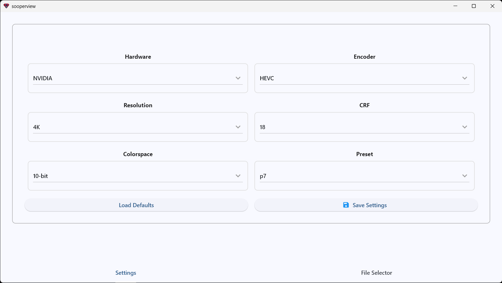
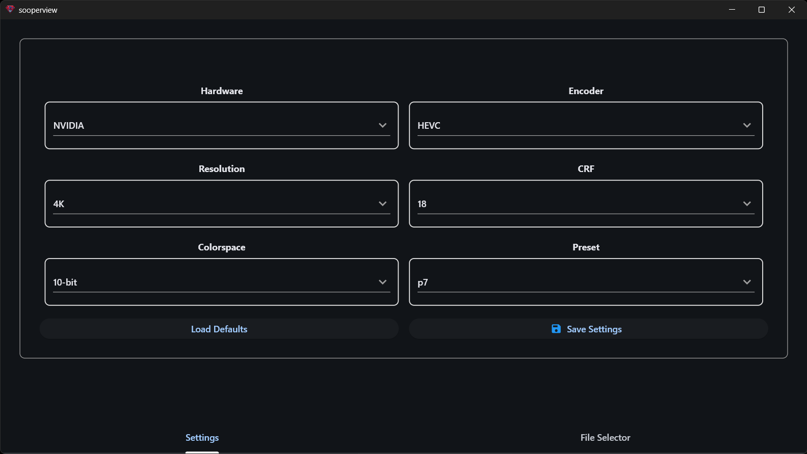
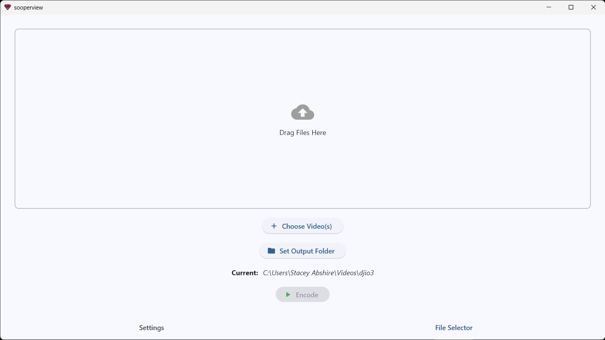
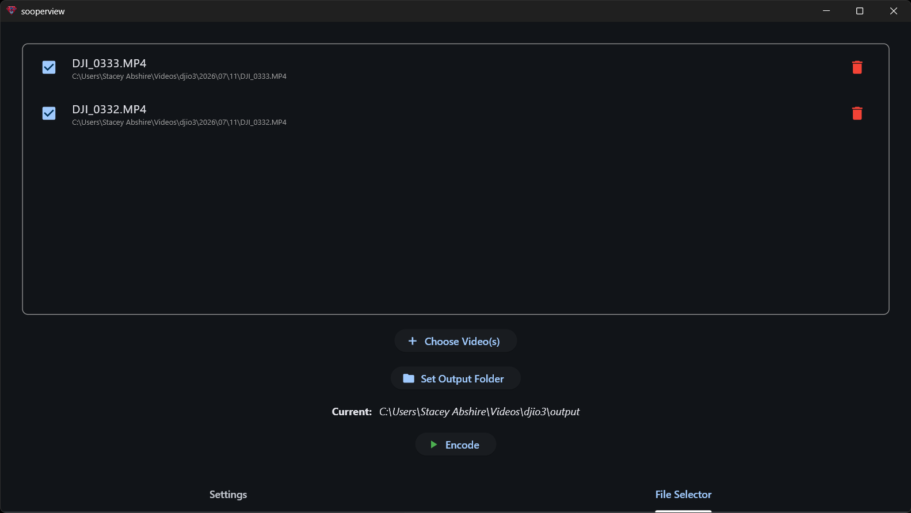
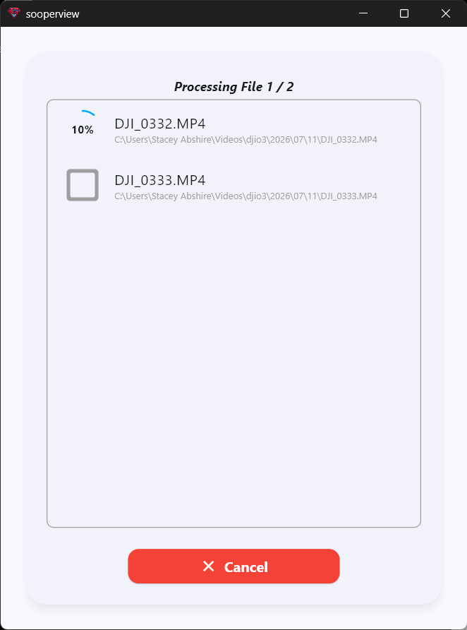
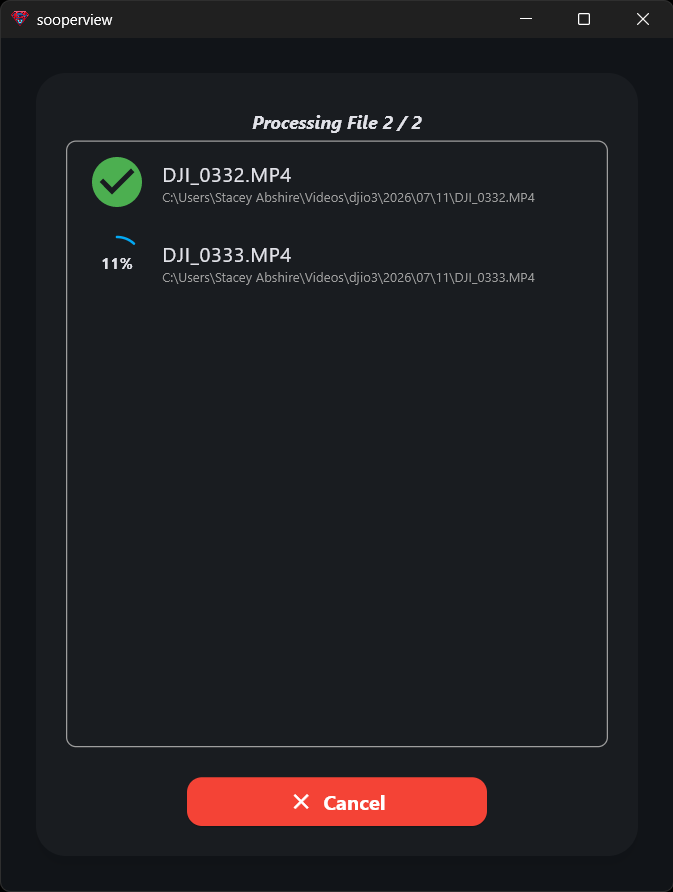

# SooperView

With the advent of the DJI O3 (and now O4) video systems, getting really good footage is very possible.  But there is a problem.  16:9 formats on the DJI cameras come at a latency (and FOV) penalties.  The solution is to fly the 4:3 modes, but now, you can't really share your epic footage on YouTube without stretching it.  There are some options that are available for doing that, but most are far from ideal.  

* You can just stretch the width, and that works, but everything looks awful.  
* You can stretch width and height to fill 16:9, but then you have cropped a large portion of your footage.
* You could use a program like GyroFlow to stretch and correct the lens distortion, but I personally think the result is awful for freestyle FPV footage.

What you need is a way to take that 4:3 full sensor footage and stretch it to 16:9 like the GoPro SuperView mode does.  This is where SooperView comes to the rescue.

SooperView runs on Windows, Mac, Android, and iOS. 

